# 🔒 AWS Security Audit & Cost Optimization


> **End-to-end AWS Security Audit project demonstrating security assessment, compliance monitoring, remediation, and cost optimization using AWS native services.**

----

# 📌 Project Overview

This project simulates a real-world AWS security assessment by intentionally introducing common cloud security misconfigurations, detecting them with AWS security services, remediating each issue, and validating compliance after remediation.

The project follows the complete cloud security lifecycle:

**Discovery → Assessment → Remediation → Compliance Validation → Continuous Monitoring → Cost Optimization**

---

# 🏗️ Architecture

<p align="center">
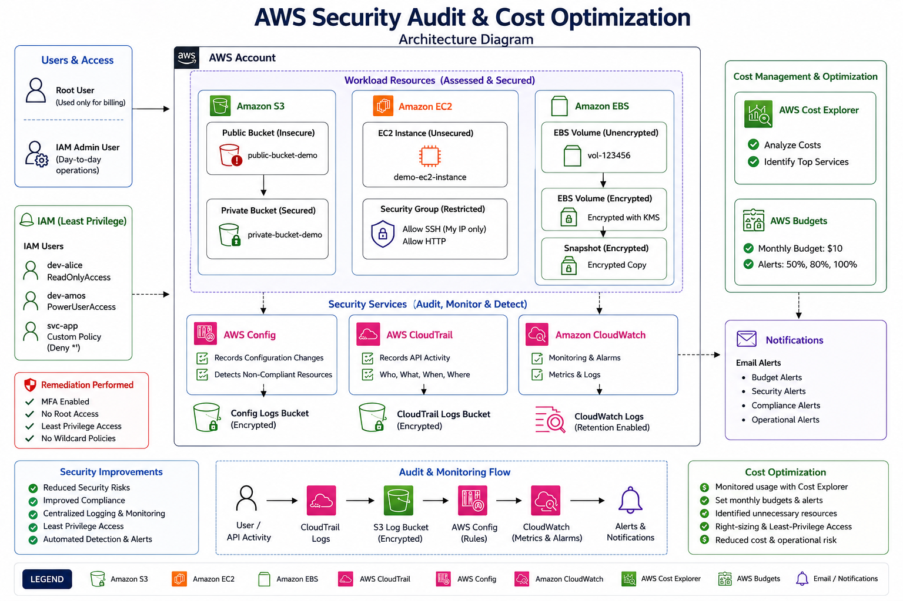
</p>

---

# 🛠️ AWS Services Used

- AWS Identity and Access Management (IAM)
- Amazon EC2
- Amazon EBS
- Amazon S3
- AWS Config
- AWS CloudTrail
- Amazon CloudWatch
- AWS Budgets
- AWS Cost Explorer
- Security Groups

---

# 🎯 Project Objectives

- Identify AWS security misconfigurations
- Implement IAM security best practices
- Secure Amazon S3 resources
- Encrypt Amazon EBS volumes
- Harden Security Groups
- Monitor compliance using AWS Config
- Enable auditing with AWS CloudTrail
- Optimize cloud costs using AWS Budgets and Cost Explorer

---

# ⚙️ Project Workflow

```text
Create Insecure Resources
        │
        ▼
AWS Config Detection
        │
        ▼
CloudTrail Logging
        │
        ▼
Security Assessment
        │
        ▼
Remediation
        │
        ▼
Compliance Validation
        │
        ▼
Cost Optimization
```

---

# 🚨 Security Findings

|        Finding                | Severity | Status |
|-------------------------------|----------|--------|
| IAM Users without MFA         | High     | ✅ Fixed |
| Public Amazon S3 Bucket       | Critical | ✅ Fixed |
| Overly Permissive IAM Policy  | Critical | ✅ Fixed |
| Unencrypted Amazon EBS Volume | High     | ✅ Fixed |
| Open Security Group           | High     | ✅ Fixed |

---

# 🔐 Remediation

## 1️⃣ IAM Users Without MFA

|                       Before                                           |                               After                                       |
|------------------------------------------------------------------------|---------------------------------------------------------------------------|
| 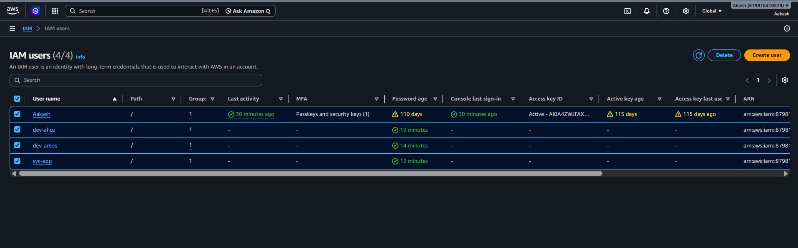 | 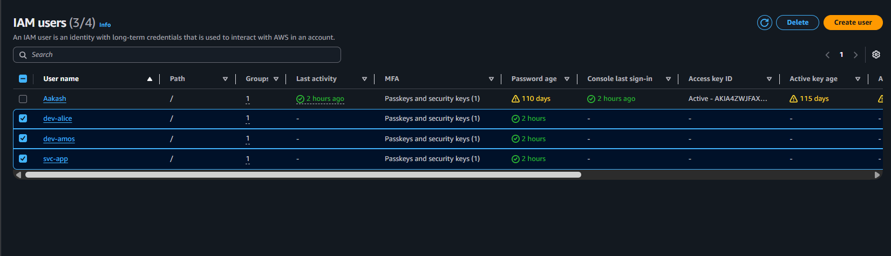 |

### Actions Performed

- Enabled Virtual MFA for all IAM users.
- Enforced MFA through IAM policies.
- Validated compliance using AWS Config (`iam-user-mfa-enabled`).

---

## 2️⃣ Public Amazon S3 Bucket

|                       Before                                           |                               After                                       |
|------------------------------------------------------------------------|---------------------------------------------------------------------------|
| 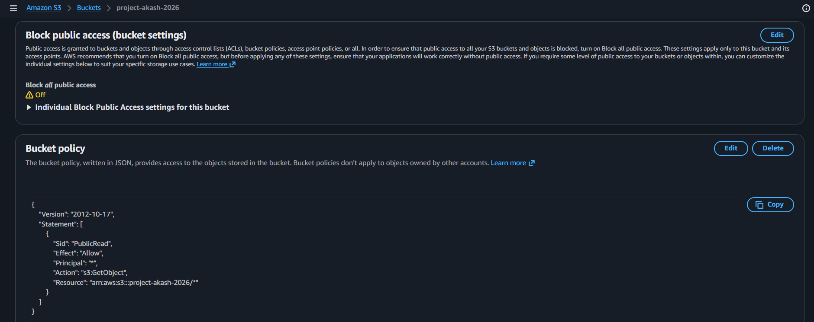 | 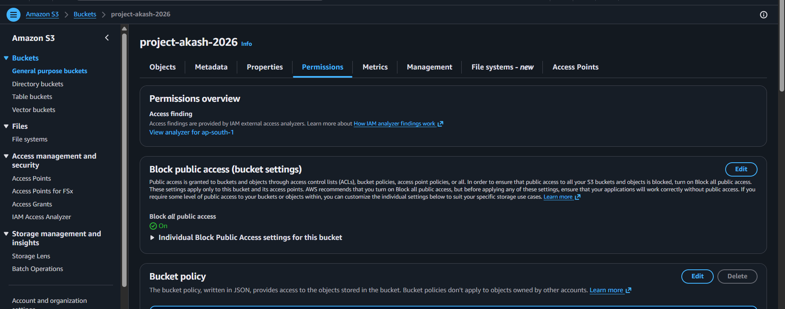 |

### Actions Performed

- Enabled Block Public Access.
- Removed public bucket policy.
- Enabled default server-side encryption (SSE-S3).
- Validated using AWS Config managed rules.

---

## 3️⃣ Overly Permissive IAM Policy

|                               After                                     |
|-----------------------------------------------------------------------|
 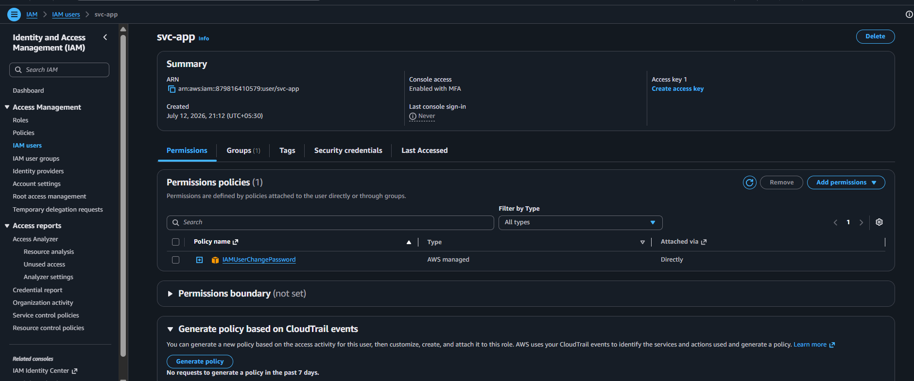 |

### Actions Performed

- Removed wildcard (`*`) permissions.
- Redesigned permissions following the **Principle of Least Privilege (PoLP)**.
- Verified remediation using AWS Config.

---

## 4️⃣ Unencrypted Amazon EBS Volume

|                       Before                                           |                               After                                       |
|------------------------------------------------------------------------|---------------------------------------------------------------------------|
| 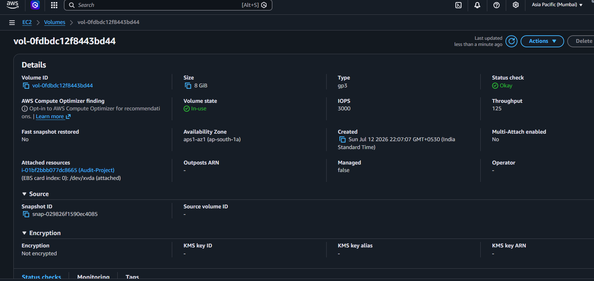 | 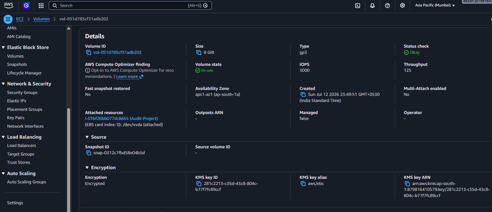 |

### Actions Performed

- Created an encrypted snapshot.
- Restored the volume using AWS KMS encryption.
- Enabled **Encrypt new EBS volumes by default**.

---

## 5️⃣ Open Security Group

|                       Before                                           |                               After                                       |
|------------------------------------------------------------------------|---------------------------------------------------------------------------|
| 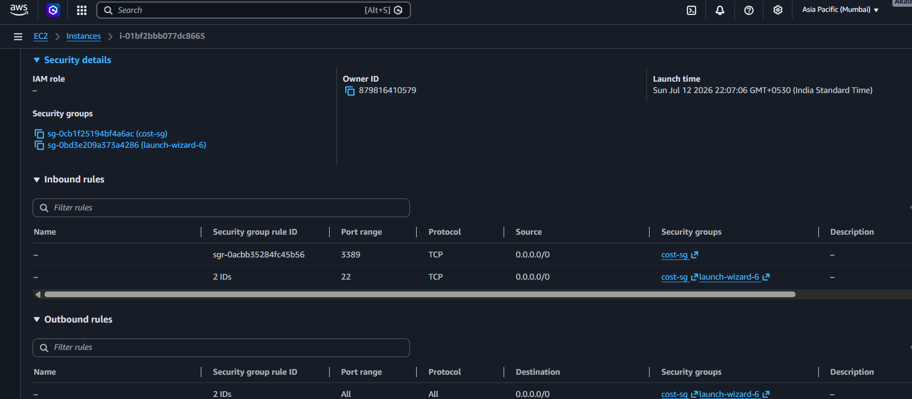 | 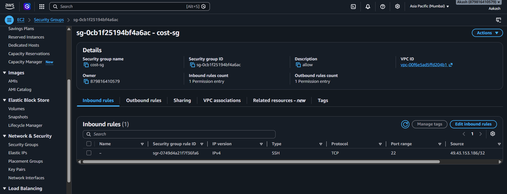 |

### Actions Performed

- Removed public SSH access (0.0.0.0/0).
- Restricted administrative access to **My IP**.
- Improved security posture following AWS best practices.

---

# 📊 AWS Config

AWS Config continuously evaluated AWS resources using managed compliance rules and verified that all security findings were successfully remediated.

|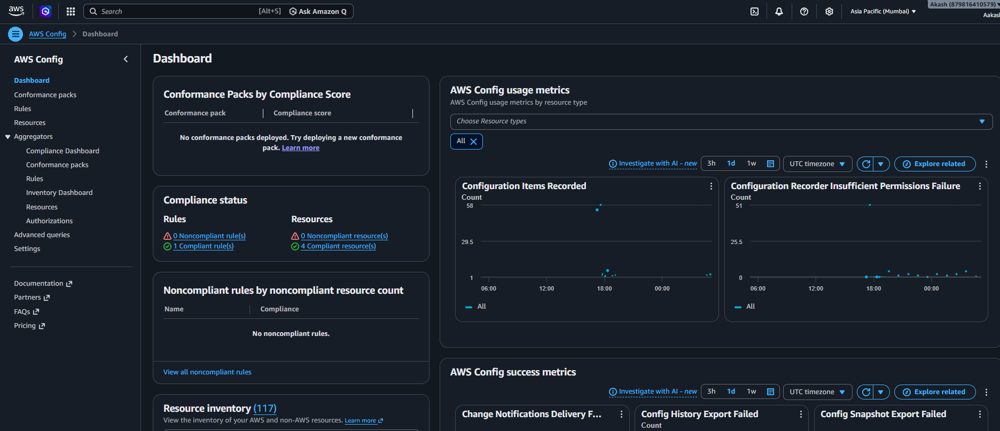 | 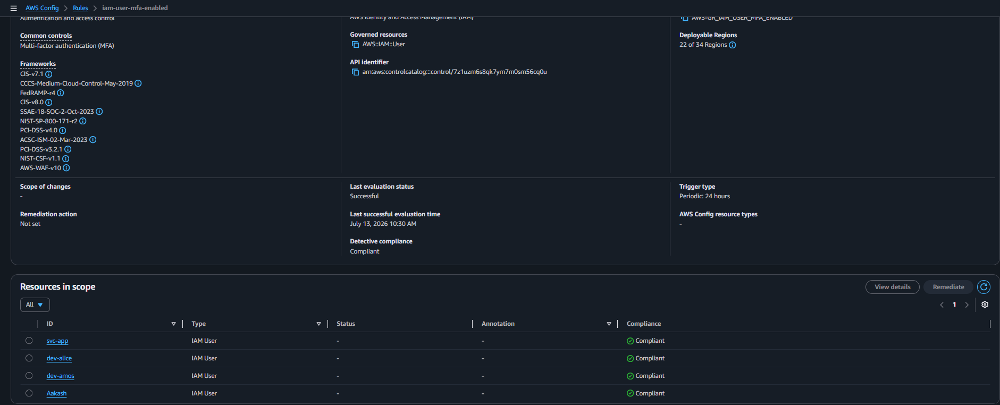 |

---

# 📜 AWS CloudTrail

AWS CloudTrail recorded all management API activity across the AWS account, providing complete audit visibility and supporting compliance validation.

<p align="center">
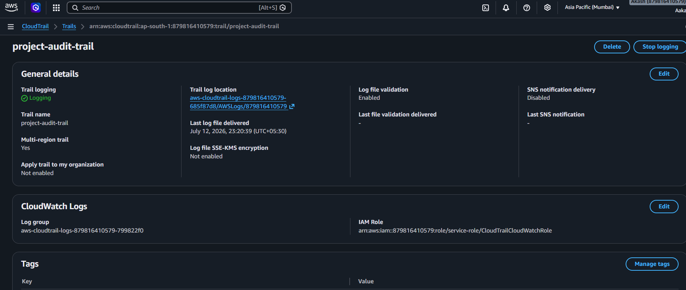
</p>

---

# 💰 Cost Optimization

## AWS Cost Explorer

<p align="center">

</p>

### Cost Optimization Measures

- Reviewed service-level spending.
- Identified idle resources.
- Evaluated EC2 right-sizing recommendations.

---

## AWS Budgets

<p align="center">

</p>

Configured monthly budget alerts at:

- 50%
- 80%
- 100%

to proactively monitor AWS spending.

---

# 📈 Project Results

- ✅ Identified and remediated **5 AWS security findings**
- ✅ Achieved compliance using AWS Config managed rules
- ✅ Enabled continuous monitoring with AWS Config
- ✅ Enabled multi-region audit logging using AWS CloudTrail
- ✅ Applied the Principle of Least Privilege (PoLP)
- ✅ Implemented proactive AWS cost monitoring using Budgets and Cost Explorer

---

# 🎯 Skills Demonstrated

- AWS Security
- AWS IAM
- AWS Config
- AWS CloudTrail
- Amazon EC2
- Amazon EBS
- Amazon S3
- Security Groups
- IAM Policy Design
- Principle of Least Privilege (PoLP)
- Compliance Monitoring
- Security Remediation
- Cloud Governance
- Cost Optimization

---

# 🚀 Future Improvements

- Integrate AWS Security Hub
- Enable Amazon GuardDuty
- Implement Infrastructure as Code (Terraform)
- Configure AWS Cost Anomaly Detection
- Automate remediation using AWS Systems Manager
- Configure SNS notifications for security alerts

---

# 📂 Repository Structure

```text
aws-security-audit-cost-optimization/
│
├── README.md
├── Architecture/
│   └── architecture.png
├── Guide/
│   └── AWS_Project_Build_Guide.pdf
├── Report/
│   └── AWS_Security_Audit_Report.pdf
├── Screenshots/
│   ├── Before/
│   ├── After/
│   ├── Monitoring/
│   └── Cost/
```

---

# ⚠️ Disclaimer

This project was completed in a personal AWS sandbox account for educational and portfolio purposes. No production resources or customer data were used.

---

# 👨‍💻 Author

**Akash**

🎓 Final Year B.Tech (Computer Science Engineering)

☁️ AWS Certified Solutions Architect – Associate (SAA-C03)

🔗 LinkedIn: https://linkedin.com/in/your-profile

📧 Email: your.email@example.com
